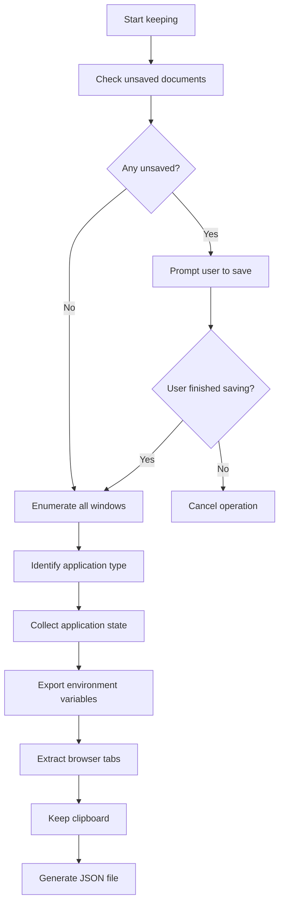
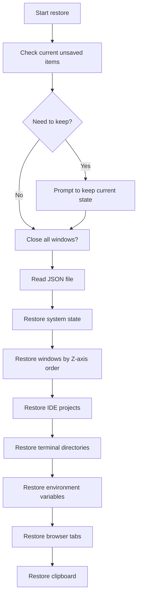

## Keeper

### 🎯 Core Function Positioning

**Goal**: Quickly save and restore complete context of Windows development environment, focusing on window layout and application state without external dependencies.

### 📊 Status Definition - Simplified Version

#### 1. **IDE Status**

```yaml
VSCode/Cursor:
  - Opened workspace/folder paths
  - Open files and their positions
  - Window position and size
  
JetBrains Suite:
  - Opened project paths
  - Window position and size
  - Detection method: Through process name and window title
```

#### 2. **Terminal Status**

```yaml
Windows Terminal/PowerShell/CMD/Termius:
  - Working directory of each tab
  - Window position and size
  - Environment variables (exported to JSON file)
  - Terminal profile/type for each tab
```

#### 3. **Browser Status**

```yaml
Chrome/Edge/Firefox/Arc:
  - All open tabs (URL, title, favicon)
  - Tab groups and organization
  - Window position and size
  - Active tab index
  - Method: Native messaging host or accessibility APIs
```

#### 4. **Document Status**

```yaml
Office Documents:
  - Detect unsaved documents
  - Record complete file paths
  - Window position and size
  
Note Applications:
  - Notion: Current page URL
  - Obsidian: Open vault and files
  - OneNote: Current notebook path
```

#### 5. **Communication Tools**

```yaml
Slack/Discord/Teams/WeChat:
  - Current channel/conversation
  - Window position and size
  - Mute status
  
Email Clients:
  - Detect draft status
  - Current folder view
```

#### 6. **System-level Status**

```yaml
Window Management:
  - Precise position of each window (x, y, width, height)
  - Window state (maximized/minimized/normal)
  - Z-axis order (which window is in front)
  - Virtual desktop assignment
  
System Status:
  - Volume level
  - Do not disturb mode status
  - Clipboard content (save to temporary file)
```

### 🔧 Windows API Integration

```csharp
// Core Windows API calls
class WindowsContextManager {
    // Get all windows
    [DllImport("user32.dll")]
    static extern bool EnumWindows(EnumWindowsProc lpEnumFunc, IntPtr lParam);
    
    // Get window position
    [DllImport("user32.dll")]
    static extern bool GetWindowRect(IntPtr hwnd, ref RECT lpRect);
    
    // Get process information
    [DllImport("user32.dll")]
    static extern uint GetWindowThreadProcessId(IntPtr hWnd, out uint lpdwProcessId);
    
    // Get window title
    [DllImport("user32.dll")]
    static extern int GetWindowText(IntPtr hWnd, StringBuilder lpString, int nMaxCount);
}
```

### 💾 Data Structure Design

```json
{
  "contextName": "pytorch-research",
  "timestamp": "2025-07-17T10:30:00Z",
  "windows": {
    "system": {
      "volume": 75,
      "doNotDisturb": false,
      "clipboard": "clipboard_cache_001.txt"
    },
    "applications": [
      {
        "type": "vscode",
        "processName": "Code.exe",
        "projectPath": "C:\\Projects\\pytorch-research",
        "openFiles": [
          "src/main.py",
          "src/model.py",
          "README.md"
        ],
        "window": {
          "x": 0,
          "y": 0,
          "width": 1920,
          "height": 1080,
          "state": "maximized",
          "virtualDesktop": 1
        }
      },
      {
        "type": "terminal",
        "processName": "WindowsTerminal.exe",
        "tabs": [
          {
            "profile": "PowerShell",
            "workingDirectory": "C:\\Projects\\pytorch-research",
            "title": "pytorch-env"
          },
          {
            "profile": "CMD",
            "workingDirectory": "C:\\Tools",
            "title": "tools"
          }
        ],
        "window": {
          "x": 1920,
          "y": 0,
          "width": 960,
          "height": 540
        }
      }
    ],
    "browsers": [
      {
        "type": "chrome",
        "processName": "chrome.exe",
        "profile": "Default",
        "tabs": [
          {
            "url": "https://pytorch.org/docs",
            "title": "PyTorch Documentation",
            "favicon": "base64_encoded_icon",
            "active": true,
            "groupId": "research",
            "groupName": "PyTorch Docs"
          },
          {
            "url": "https://github.com/pytorch/pytorch",
            "title": "pytorch/pytorch: Tensors and Dynamic neural networks",
            "favicon": "base64_encoded_icon",
            "active": false
          }
        ],
        "window": {
          "x": 1920,
          "y": 540,
          "width": 960,
          "height": 540
        }
      }
    ],
    "environmentVariables": {
      "PATH": "C:\\Python39;C:\\Python39\\Scripts;...",
      "PYTHONPATH": "C:\\Projects\\pytorch-research\\src",
      "CUDA_HOME": "C:\\Program Files\\NVIDIA GPU Computing Toolkit\\CUDA\\v11.8",
      "VIRTUAL_ENV": "C:\\Projects\\pytorch-research\\venv"
    }
  }, 
  "environmentSnapshot": "contexts/pytorch-research/.g_assist_env_20250717_103000.json"
}
```

### 🎮 Voice Commands - Simplified Version

```bash
# Core commands
"Keep context as [project name]"
"Restore [project name]"
"Close windows" # First perform quick keep, then close windows with kept state
"Minimize windows" # Save & minimize all windows (safer than closing)

# Quick commands
"Quick keep"  # Auto-generate project name from active windows
"Quick switch" # List recent 5 contexts for selection
"Keep tabs only" # Keep only browser tabs
"Restore tabs only" # Restore only browser tabs
"Keep layout only" # Keep only window positions
"Restore layout only" # Restore only window positions
```

### ⚡ Implementation Strategy

#### 1. **Keep Process**



#### 2. **Restore Process**



### 🔌 Core Components

#### Browser Tab Extraction

```python
# Browser tab extraction without plugins
class BrowserTabExtractor:
    def extract_chrome_tabs(self):
        """Extract Chrome tabs using debugging protocol"""
        import requests
        import json
        
        # Find Chrome debugging port
        chrome_port = self.find_chrome_debug_port()
        
        # Get tab list
        response = requests.get(f'http://localhost:{chrome_port}/json')
        tabs = response.json()
        
        return [{
            'url': tab['url'],
            'title': tab['title'],
            'favicon': self.get_favicon(tab['url']),
            'active': tab.get('active', False)
        } for tab in tabs if tab['type'] == 'page']
    
    def extract_firefox_tabs(self):
        """Extract Firefox tabs from session store"""
        import json
        import os
        
        # Find Firefox profile
        profile_path = self.find_firefox_profile()
        session_file = os.path.join(profile_path, 'sessionstore-backups', 'recovery.jsonlz4')
        
        # Decompress and parse
        session_data = self.decompress_mozlz4(session_file)
        return self.parse_firefox_session(session_data)
```

#### Environment Variable Management

```python
# Direct environment variable management
class EnvironmentManager:
    def keep_environment(self, context_name):
        """Keep ALL current environment variables to timestamped file"""
        import os
        import json
        from datetime import datetime
        
        # Get all environment variables
        env_vars = dict(os.environ)
        
        # Create timestamp
        timestamp = datetime.now().strftime('%Y%m%d_%H%M%S')
        
        # Keep to file with specific naming pattern
        env_file = f".g_assist_env_{timestamp}.json"
        env_path = os.path.join("contexts", context_name, env_file)
        
        # Ensure directory exists
        os.makedirs(os.path.dirname(env_path), exist_ok=True)
        
        # Keep all environment variables
        with open(env_path, 'w', encoding='utf-8') as f:
            json.dump(env_vars, f, indent=2, ensure_ascii=False)
        
        return env_path
    
    def restore_environment(self, context_name):
        """Restore environment variables from the latest file"""
        import json
        import os
        import glob
        from datetime import datetime
        
        # Find all environment files for this context
        pattern = os.path.join("contexts", context_name, ".g_assist_env_*.json")
        env_files = glob.glob(pattern)
        
        if not env_files:
            raise FileNotFoundError(f"No environment files found for context: {context_name}")
        
        # Sort by datetime to get the latest
        env_files.sort(key=lambda x: self._extract_datetime(x), reverse=True)
        latest_env_file = env_files[0]
        
        # Load environment variables
        with open(latest_env_file, 'r', encoding='utf-8') as f:
            env_vars = json.load(f)
        
        # Clear current environment and set new variables
        os.environ.clear()
        for key, value in env_vars.items():
            os.environ[key] = value
        
        # Log restoration
        self._log_restoration(latest_env_file, len(env_vars))
        
        # Optionally create batch file for system-wide restore
        self.create_env_batch(env_vars, context_name)
        
        return latest_env_file
    
    def _extract_datetime(self, filename):
        """Extract datetime from filename .g_assist_env_YYYYMMDD_HHMMSS.json"""
        import re
        from datetime import datetime
        
        pattern = r'\.g_assist_env_(\d{8}_\d{6})\.json'
        match = re.search(pattern, filename)
        
        if match:
            datetime_str = match.group(1)
            return datetime.strptime(datetime_str, '%Y%m%d_%H%M%S')
        return datetime.min
    
    def create_env_batch(self, env_vars, context_name):
        """Create batch file for manual environment restoration"""
        from datetime import datetime
        
        timestamp = datetime.now().strftime('%Y%m%d_%H%M%S')
        batch_file = os.path.join("contexts", context_name, f"restore_env_{timestamp}.bat")
        
        with open(batch_file, 'w', encoding='utf-8') as f:
            f.write('@echo off\n')
            f.write(f'REM Environment restoration for {context_name}\n')
            f.write(f'REM Generated at {timestamp}\n\n')
            
            for key, value in env_vars.items():
                # Escape special characters for batch file
                value = value.replace('%', '%%')
                value = value.replace('"', '""')
                f.write(f'set "{key}={value}"\n')
            
            f.write('\necho Environment variables restored successfully.\n')
            f.write('pause\n')
    
    def list_environment_snapshots(self, context_name):
        """List all environment snapshots for a context"""
        import glob
        import os
        from datetime import datetime
        
        pattern = os.path.join("contexts", context_name, ".g_assist_env_*.json")
        env_files = glob.glob(pattern)
        
        snapshots = []
        for file in env_files:
            dt = self._extract_datetime(file)
            size = os.path.getsize(file)
            snapshots.append({
                'file': file,
                'datetime': dt.strftime('%Y-%m-%d %H:%M:%S'),
                'size': size,
                'age_hours': (datetime.now() - dt).total_seconds() / 3600
            })
        
        # Sort by datetime, newest first
        snapshots.sort(key=lambda x: x['datetime'], reverse=True)
        return snapshots
    
    def cleanup_old_snapshots(self, context_name, keep_last=5):
        """Clean up old environment snapshots, keeping only the most recent ones"""
        snapshots = self.list_environment_snapshots(context_name)
        
        if len(snapshots) > keep_last:
            for snapshot in snapshots[keep_last:]:
                os.remove(snapshot['file'])
                self._log_cleanup(snapshot['file'])
    
    def _log_restoration(self, file_path, var_count):
        """Log environment restoration"""
        import logging
        
        logging.info(f"Restored {var_count} environment variables from {file_path}")
    
    def _log_cleanup(self, file_path):
        """Log file cleanup"""
        import logging
        
        logging.info(f"Cleaned up old environment snapshot: {file_path}")
```

Usage Example:


```python
# In the main ContextKeeper class
class ContextKeeper:
    def keep_context(self, context_name):
        """Keep current context"""
        # … other keep operations …
        
        # Keep environment variables
        env_manager = EnvironmentManager()
        env_path = env_manager.keep_environment(context_name)
        
        # Include reference in context data
        context_data['environmentSnapshot'] = env_path
        
        # Optionally cleanup old snapshots
        env_manager.cleanup_old_snapshots(context_name, keep_last=10)
        
        return context_data
    
    def restore_context(self, context_name):
        """Restore context"""
        # … other restore operations …
        
        # Restore environment variables (automatically uses latest)
        env_manager = EnvironmentManager()
        restored_file = env_manager.restore_environment(context_name)
        
        print(f"Restored environment from: {restored_file}")
```
#### Terminal State Management

```python
# Terminal state extraction
class TerminalManager:
    def get_terminal_tabs(self, hwnd):
        """Extract tab information from various terminals"""
        process_name = self.get_process_name(hwnd)
        
        if 'WindowsTerminal' in process_name:
            return self.extract_windows_terminal_tabs(hwnd)
        elif 'Termius' in process_name:
            return self.extract_termius_tabs(hwnd)
        elif 'cmd.exe' in process_name or 'powershell' in process_name:
            return self.extract_cmd_info(hwnd)
    
    def extract_windows_terminal_tabs(self, hwnd):
        """Extract Windows Terminal tabs using accessibility APIs"""
        import pywinauto
        
        app = pywinauto.Application().connect(handle=hwnd)
        window = app.window(handle=hwnd)
        
        tabs = []
        # Use UI automation to get tab information
        tab_strip = window.child_window(control_type="TabControl")
        for tab in tab_strip.children():
            tabs.append({
                'title': tab.window_text(),
                'workingDirectory': self.get_working_directory(tab),
                'profile': self.detect_shell_type(tab)
            })
        
        return tabs
```

### 🚨 Error Handling

```yaml
Error Scenarios:
  1. Browser not accessible:
     - Try alternative extraction methods
     - Fall back to bookmark export
     - Log tabs that couldn't be saved
  
  2. Terminal access denied:
     - Request elevated permissions
     - Use alternative detection methods
     - Save what's accessible
  
  3. Application version changes:
     - Maintain compatibility mappings
     - Best effort restore
     - Log incompatible parts
  
  4. File/path does not exist:
     - Provide options: skip/select new path/create
     - Auto-search for moved files
```

### 🔍 Monitoring and Logging

```python
# Log format
{
    "action": "keep_context",
    "timestamp": "2025-07-17T10:30:00Z",
    "context_name": "pytorch-research",
    "duration_ms": 2500,
    "stats": {
        "windows_kept": 8,
        "browser_tabs": 42,
        "terminal_tabs": 5,
        "env_variables": 23
    },
    "warnings": ["Arc browser tabs kept with limited info"],
    "errors": []
}
```

### 📦 Installation Requirements

```yaml
Dependencies:
  Python packages:
    - pywin32: Windows API access
    - psutil: Process management
    - pywinauto: UI automation
    - requests: Browser debugging protocol
    - Pillow: Favicon processing
  
  No external browser plugins required
  No third-party session managers needed
```
